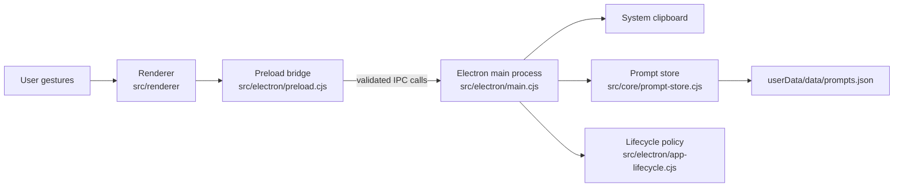

# Architecture

## Overview

Desk Pet Prompt Book is a local Electron application with a plain HTML/CSS/JavaScript renderer and a framework-independent JSON store. Privileged desktop operations stay in the Electron main process; the renderer receives only a narrow API through the preload bridge.

## Runtime Boundaries

### Electron Main Process

`src/electron/main.cjs` owns capabilities that the renderer must not access directly:

- creating and positioning the transparent desktop window;
- switching between the `220x220` pet mode and centered `1024x700` panel mode;
- keeping drag movement inside display work areas without changing window size;
- fixing `userData` to `%APPDATA%\desk-pet-prompt-book` before logging or store initialization;
- acquiring the single-instance lock and focusing the existing window after a second launch;
- providing one native right-click `退出桌宠` command for both window modes;
- reading and writing the system clipboard;
- creating the prompt store with its concrete file path; and
- registering explicit IPC handlers for prompt, project, stage, keyword, view-state, and window operations.

The main process also writes `startup-log.txt` under `userData` when a top-level error, rejected renderer load, or renderer-process failure occurs.

### Preload Bridge

`src/electron/preload.cjs` exposes `window.deskPet` through `contextBridge`. Each method maps to one named IPC operation. It does not expose `ipcRenderer`, Node.js, filesystem access, or arbitrary channel invocation to page code.

New privileged behavior should add one narrow preload method and one matching main-process handler. Avoid generic `invoke(channel, ...args)` APIs because they erase the trust boundary.

### Renderer

`src/renderer` contains the semantic interface, styles, interactions, and four runtime image assets. It:

- separates single-click panel opening from double-click capture;
- renders the project directory, filters, prompt list, dialogs, and feedback;
- asks the preload bridge for data and mutations in Electron mode; and
- uses an in-memory preview model plus browser clipboard APIs during browser development.

Renderer Node integration is disabled. The renderer loads local files and does not import internal `.codex` development material.

### Core Store

`src/core/prompt-store.cjs` contains data normalization, sorting, query, mutation, and JSON persistence. It depends on an injected file path and optionally injected clock/ID functions, which lets Node.js tests run without Electron.

The store writes formatted JSON to a sibling `.tmp` file and renames it over the target. This avoids exposing a partially written JSON document. The store is not a transactional multi-process database, so the Electron lifecycle layer prevents a second application instance from reaching the shared prompt file.

## Primary Data Flows

### Clipboard Capture

1. The renderer recognizes a desktop-pet double-click.
2. `window.deskPet.captureClipboardPrompt()` invokes `prompts:captureClipboard`.
3. The Electron main process reads text from the system clipboard.
4. The core store trims and normalizes line endings, rejects empty input, and checks exact normalized content for duplicates.
5. A new prompt receives a generated ID, timestamps, a title from the first non-empty line, no project, no stage, rating `0`, and usage count `0`.
6. The store saves JSON and returns a status used by the renderer's lightweight feedback.

Single-click panel opening does not enter this flow and does not read the clipboard.

### Query And Display

1. The renderer sends one query contract containing view, project, pending filter, stage, search scope, query text, and sort mode.
2. The store decorates prompts with keyword names, selects the requested view, applies pending/stage/search filters, and sorts the result.
3. The renderer builds semantic manuscript entries and keeps project browsing separate from the explicit current-project marker.

Search defaults to the full prompt library when text is present unless the user selects current-view-only scope.

### Copy And Usage Tracking

1. The renderer invokes `prompts:copyPrompt` with a prompt ID.
2. The store updates `lastUsedAt` and `useCount` and persists the change.
3. The main process writes the returned prompt body to the system clipboard.
4. The renderer shows copy feedback and refreshes ordering when needed.

### Mutations

Prompt edits, deletion, project assignment, rating, and pinning use dedicated IPC methods. Project deletion clears project and stage references on affected prompts instead of deleting those prompts. Stage hiding removes the stage from active filters without deleting prompt bodies.

## Window Model

The product uses one `BrowserWindow`, not a separate panel window:

- Pet mode: fixed `220x220`, placed near the primary display's lower-right work area.
- Panel mode: fixed `1024x700`, centered on the display matching the pet's current bounds.
- Closing the panel restores the saved compact pet bounds.
- Dragging is available only through explicit renderer zones and main-process pointer tracking.
- A second application launch restores, shows, and focuses this existing window.
- Right-clicking either mode opens a native menu; selecting `退出桌宠` calls Electron's normal quit flow.

Display changes reapply the current fixed-size contract. Bounds are clamped to the selected display's work area.

## Browser Preview

`scripts/preview-server.cjs` serves the repository through local HTTP for browser inspection. It resolves requests relative to the repository root and rejects path traversal. The default renderer entry is `src/renderer/index.html`.

Preview mode is not a security-equivalent substitute for Electron: clipboard permissions, the preload bridge, window sizing, and persistence behavior differ.

## Windows Packaging And Release

`electron-builder.yml` packages the runtime into one assisted per-user NSIS x64 installer. The stable application ID is `com.qiuqiukong.deskpetpromptbook`, the executable is `DeskPetPromptBook.exe`, and the public artifact follows `Desk-Pet-Prompt-Book-Setup-${version}.exe`. The installer creates desktop and Start menu shortcuts, does not add startup launch, and does not delete AppData during uninstall.

`.github/workflows/release.yml` runs only for `v*` tags. It verifies that the tagged commit belongs to protected `origin/main`, runs the complete quality gate, builds with signing discovery disabled, creates and verifies `SHA256SUMS.txt`, uploads a recovery artifact, then publishes the GitHub Pre-release. A failed build cannot create the public Release.

## Security Posture

The Electron window currently enables:

- `contextIsolation: true`;
- `nodeIntegration: false`;
- `sandbox: true`;
- local renderer file loading; and
- a capability-specific preload API.

These controls reduce renderer privileges but do not encrypt local data or protect against malware running as the same operating-system user. See [`SECURITY.md`](../SECURITY.md) and [`PRIVACY.md`](../PRIVACY.md).

## Verification Layers

- `tests/prompt-store.test.mjs` verifies data behavior and persistence.
- `tests/electron-pet-shell.test.mjs` verifies Electron window and IPC contracts.
- `tests/electron-app-lifecycle.test.mjs` verifies stable data paths, single-instance ownership, focus, and native exit behavior without launching Electron.
- `tests/desktop-pet-preview.test.mjs` verifies renderer structure, asset geometry, and interaction contracts.
- `tests/open-source-readiness.test.mjs` verifies repository portability, package metadata, documentation, and asset boundaries.

Behavior changes should begin with a failing test at the narrowest applicable layer, followed by the full test and Electron smoke gates.
